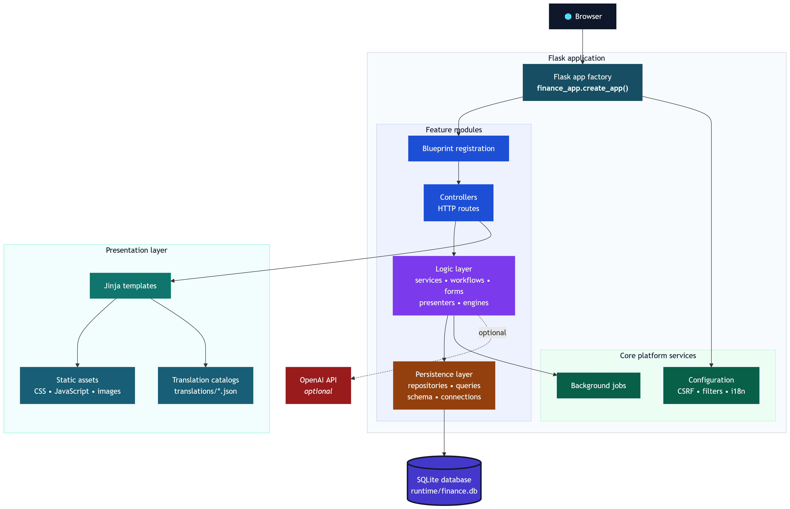

# Architecture

FinScope is organized as a Flask application with feature modules, fully supported SQLite or MySQL persistence, Jinja templates, and browser-side JavaScript for page behavior.

## Application architecture diagram

The diagram shows the stable runtime boundaries reflected by `finance_app.__init__.create_app`, the registered blueprints in `finance_app.modules`, and the repository-level [runtime/](../runtime/) data directory.

The editable Mermaid source is stored in [docs/diagrams/architecture.mmd](diagrams/architecture.mmd). Keep the rendered SVG generated from that source when the architecture changes.

## Module structure

Feature code lives under [src/finance_app/modules/](../src/finance_app/modules/). A module should keep presentation, logic, and persistence concerns separate where practical.

Common files, with representative examples:

| File | Responsibility |
| --- | --- |
| [controller.py](../src/finance_app/modules/transactions/controller.py) | Flask routes and HTTP request/response handling. |
| [service.py](../src/finance_app/modules/transactions/service.py) | Use-case orchestration and page context builders. |
| [forms.py](../src/finance_app/modules/rules/forms.py) | Form parsing and validation. |
| [presenter.py](../src/finance_app/modules/transactions/presenter.py) | View-model shaping for templates. |
| [queries.py](../src/finance_app/modules/transactions/queries.py) | Read-side SQL. |
| [repository.py](../src/finance_app/modules/transactions/repository.py) | Mutation persistence helpers. |
| [workflow.py](../src/finance_app/modules/upload/workflow.py) | Multi-step application workflows. |
| [engine.py](../src/finance_app/modules/rules/engine.py) | Domain logic that is independent from Flask. |

Not every module needs every file. Small modules can stay compact, but new behavior should not push SQL, form parsing, domain decisions, and template shaping into one controller.

## Layering expectations

- Presentation layer: Flask controllers, Jinja templates, static assets, and presenters.
- Logic layer: services, workflows, engines, form parsers, and orchestration code.
- Data layer: schema code, SQL query helpers, repositories, and persistence utilities.

Controllers should parse HTTP inputs, call the logic layer, and return redirects or rendered templates. Services and workflows should own business decisions. Query and repository helpers should own SQL details.

## User interface text

User-facing static text should go through `finance_app.core.i18n` using English source text as the message id. Templates use the global `_()` helper, Python routes can use `gettext()`, and browser-side scripts use `window.financeTranslate()`.

Translation catalogs are JSON files under [src/finance_app/translations/](../src/finance_app/translations/). Keep user data, merchant names, category names, account names, and uploaded statement content untranslated.

## Current module examples

- [src/finance_app/modules/transactions/](../src/finance_app/modules/transactions/): [controller.py](../src/finance_app/modules/transactions/controller.py), [service.py](../src/finance_app/modules/transactions/service.py), [filters.py](../src/finance_app/modules/transactions/filters.py), [queries.py](../src/finance_app/modules/transactions/queries.py), [repository.py](../src/finance_app/modules/transactions/repository.py), [presenter.py](../src/finance_app/modules/transactions/presenter.py), and [importer.py](../src/finance_app/modules/transactions/importer.py).
- [src/finance_app/modules/rules/](../src/finance_app/modules/rules/): [controller.py](../src/finance_app/modules/rules/controller.py), [service.py](../src/finance_app/modules/rules/service.py), [forms.py](../src/finance_app/modules/rules/forms.py), [engine.py](../src/finance_app/modules/rules/engine.py), [import_export.py](../src/finance_app/modules/rules/import_export.py), [repository.py](../src/finance_app/modules/rules/repository.py), and [listing.py](../src/finance_app/modules/rules/listing.py).

## Runtime boundaries

Runtime state belongs outside source-controlled code:

- SQLite databases
- MySQL databases
- uploaded statements
- generated logs
- backups
- local secrets

Keep those in [runtime/](../runtime/) or another protected local path.
