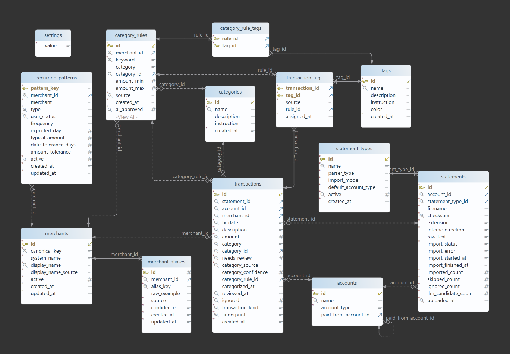

# Database

FinScope stores local application data in SQLite by default. The default runtime database is `runtime/finance.db`, and runtime schema creation is managed by SQLAlchemy Core metadata in `src/finance_app/database/tables.py`.

The database layer maintains the Core engine/connection lifecycle in `src/finance_app/database/engine.py`. Startup creates the configured schema from Core metadata and seeds runtime defaults through Core for SQLite and other SQLAlchemy URLs. `src/finance_app/database/tables.py` is the runtime initialization path and the test suite's schema source of truth.

Runtime settings, statement type management, account persistence, merchant persistence, category/tag taxonomy helpers, taxonomy admin CRUD, category rule repository helpers, imported-rule repository helpers, rule import/export job entry points, rule listing queries, rule create/update/approval/delete/preview/apply workflows, standalone categorization, recurring pattern writes, transaction list queries and route mutations, transaction repository helpers, transaction import deduplication, home summary queries, upload page context queries, upload queue/import/reprocess/undo workflows, dashboard/comparison/calendar reporting read models, review page/workflow queries and mutations, and jobs page settings lookups use SQLAlchemy Core connections.

Runtime-facing persistence helpers now require SQLAlchemy Core connections. SQLite remains supported through `sqlite:///` database URLs.

Money amounts are modeled in SQLAlchemy Core as fixed-scale `Numeric(14, 2)` values. This applies to transaction amounts, category rule amount bounds, and recurring pattern amount settings; probability-style fields such as category confidence remain floating point.

Persisted enum-like text values, such as import statuses, parser types, category sources, rule sources, and recurring pattern statuses, are defined in `src/finance_app/core/constants.py`. The schema derives `CHECK` constraints from those constants so Python validation and SQLite constraints stay aligned.

## Interactive schema

The interactive database schema is available at [db-schema.html](db-schema.html). It is a dynamic HTML page generated with DBSchema from `finance.db`.

Use the interactive schema when you need to inspect table relationships, indexes, constraints, and column details visually. Use `src/finance_app/database/tables.py` as the source of truth for runtime schema implementation.

## Data model

FinScope uses SQLite by default. Schema creation and startup initialization are handled by SQLAlchemy Core metadata and `init_db()`.




### Table responsibilities

#### `accounts`

Stores financial account names used to group statements and transactions. The `name` column is unique and cannot be blank.

- `account_type`: Account role used by imports and reports. Valid values are `checking`, `savings`, and `credit_card`.
- `paid_from_account_id`: Optional funding account for credit cards. This lets FinScope mark matching checking-account payments as non-reportable balance movements.

#### `statement_types`

Defines the statement parsers available on the settings and upload pages.

- `name`: User-facing statement type label, such as checking account or credit card.
- `parser_type`: Parser behavior to use for uploads. Valid values are `credit_card`, `bank_account`, and `interac_etransfer`.
- `import_mode`: Import behavior. `ledger` creates transaction rows; `enrichment` updates existing rows without adding duplicate ledger activity.
- `default_account_type`: Account role selected by default when a user uploads this statement type.
- `active`: Soft-delete flag so old statement types can be hidden without losing historical references.
- `created_at`: Creation timestamp for auditing and ordering.

#### `statements`

Tracks every uploaded statement and its import status.

- `account_id`: Optional account linked to the statement.
- `statement_type_id`: Parser configuration used for the upload.
- `filename`: Original uploaded filename.
- `checksum`: Unique file checksum used to detect exact duplicate uploads.
- `extension`: Original file extension used by import logic.
- `interac_direction`: Interac e-Transfer direction override for ambiguous exports. `auto` uses header detection; `sent` and `received` sign positive-only exports before matching existing checking rows.
- `raw_text`: Extracted statement content retained for reprocessing.
- `import_status`: Import lifecycle state: `pending`, `queued`, `running`, `completed`, or `failed`.
- `import_error`: Last import failure message, when applicable.
- `import_started_at` and `import_finished_at`: Processing timestamps for diagnostics.
- `imported_count`, `skipped_count`, `ignored_count`, `llm_candidate_count`: Import result counters shown in statement history.
- `uploaded_at`: Upload timestamp.

#### `merchants`

Stores stable merchant identities separately from raw statement descriptions.

- `canonical_key`: Unique normalized merchant key used for matching and deduplication.
- `system_name`: System-derived merchant name before user overrides.
- `display_name`: Current user-facing merchant name.
- `display_name_source`: Tracks whether the display name came from the system or a user edit.
- `active`: Soft-delete flag for hiding merchants without breaking references.
- `created_at` and `updated_at`: Lifecycle timestamps.

#### `merchant_aliases`

Maps cleaned statement variants to canonical merchants.

- `merchant_id`: Parent merchant. Aliases are deleted when the merchant is deleted.
- `alias_key`: Unique normalized alias key.
- `raw_example`: Representative raw statement text for the alias.
- `source`: Origin of the alias, such as import, rule, fallback, or user input.
- `confidence`: Alias confidence: `high`, `medium`, or `low`.
- `created_at` and `updated_at`: Lifecycle timestamps.

#### `categories`

Stores transaction category definitions.

- `name`: Unique category name.
- `description`: Optional explanatory text for users.
- `instruction`: Optional LLM instruction used during automated categorization.
- `created_at`: Creation timestamp.

#### `transactions`

Stores imported ledger rows and their categorization state.

- `statement_id`: Statement that produced the transaction, when imported from a statement.
- `account_id`: Account associated with the transaction.
- `merchant_id`: Stable merchant identity, separate from raw description text.
- `tx_date`: Transaction date from the source statement.
- `description`: Transaction display description. This normally starts as the raw statement description, but enrichment imports can replace generic bank text with a clearer counterparty.
- `amount`: Signed transaction amount.
- `category`: Cached category name retained for older query paths.
- `category_id`: Stable category reference used for renames and relationships.
- `needs_review`: Marks rows that need manual category review.
- `category_source`: Origin of the category: `unknown`, `rule`, `history`, `ai`, or `manual`.
- `category_confidence`: Confidence score for automatic categories from rules, historical matches, or AI.
- `category_rule_id`: Rule that assigned the category, when applicable.
- `category_metadata`: JSON evidence summary for the final categorization decision, including the controlled audit `decision_source` (`rule`, `similar_transactions`, `llm`, `llm_with_similar_transactions`, `combined`, `manual`, or `unknown`) plus rule, history, LLM, or manual-review details when available.
- `categorized_at` and `reviewed_at`: Category workflow timestamps.
- `ignored`: Soft-ignore flag for excluding rows without deleting them.
- `transaction_kind`: Cash-flow role used by reports. Expenses and income are reportable; payments and transfers remain visible but are excluded from spending/income totals.
- `fingerprint`: Unique transaction fingerprint used to prevent duplicate ledger rows.
- `created_at`: Import timestamp for the row.

#### `category_rules`

Stores manual, automatic, or default rules used to categorize transactions.

- `account_id`: Optional account scope. When present, the rule only applies to transactions from that account.
- `merchant_id`: Optional exact merchant scope. When null, the rule matches by normalized keyword.
- `keyword`: Text or normalized keyword used by broad matching.
- `category`: Cached category name retained for older query paths.
- `category_id`: Stable category assigned by the rule.
- `amount_min` and `amount_max`: Optional amount range constraints.
- `direction`: Optional signed direction constraint: `any`, `debit`, or `credit`.
- `keyword_scope_key`, `account_id_key`, `amount_min_key`, and `amount_max_key`: Generated columns used only by database constraints to enforce portable duplicate-rule prevention when merchant scope, account scope, or amount bounds are null.
- `source`: Rule origin: `manual`, `automatic`, or `default`.
- `ai_approved`: Approval flag for automatically suggested rules.
- `created_at`: Creation timestamp.

Unique constraints prevent duplicate rules for the same merchant or keyword, account scope, direction, and amount window across SQLite, MySQL, and PostgreSQL schema creation.

#### `tags`

Stores reusable labels that can be attached to transactions or category rules.

- `name`: Unique tag name.
- `description`: Optional user-facing explanation.
- `instruction`: Optional LLM guidance for applying the tag.
- `color`: Display color used by the UI.
- `created_at`: Creation timestamp.

#### `transaction_tags`

Join table between `transactions` and `tags`.

- `transaction_id` and `tag_id`: Composite primary key so a tag can be assigned only once per transaction.
- `source`: Origin of the tag assignment: `unknown`, `rule`, `history`, `ai`, or `manual`.
- `rule_id`: Category rule that assigned the tag, when applicable.
- `assigned_at`: Assignment timestamp.

#### `category_rule_tags`

Join table between category rules and tags. The composite key of `rule_id` and `tag_id` prevents duplicate tag assignments on a rule.

#### `settings`

Stores runtime settings as key/value pairs. The `key` column is the primary key and cannot be blank; values are stored as text and parsed by the settings layer.

#### `recurring_patterns`

Stores user overrides and status for detected recurring activity.

- `pattern_key`: Primary key used for fuzzy or legacy recurring pattern lookups.
- `merchant_id`: Optional stable merchant scope for durable merchant-bound overrides.
- `merchant`: Merchant text snapshot used for display and fallback matching.
- `type`: Recurring activity direction, either `spending` or `income`.
- `user_status`: User state for the pattern: `detected`, `confirmed`, `ignored`, or `edited`.
- `frequency`: Detected or user-edited recurrence cadence.
- `expected_day`: Expected day of month, constrained to 1 through 31.
- `typical_amount`: Typical positive amount for the recurring pattern.
- `date_tolerance_days`: Allowed date drift around the expected day.
- `amount_tolerance`: Allowed amount variance.
- `active`: Soft-delete flag for recurring patterns.
- `created_at` and `updated_at`: Lifecycle timestamps.

Rows with `merchant_id` and `type` are unique through a portable nullable unique constraint, which keeps merchant-bound recurring overrides stable. Rows with a null merchant ID remain keyword-fuzzy and are looked up by `pattern_key`.

### Relationship notes

- Merchant identity is modeled separately from imported transaction descriptions. `transactions.description` stores the display text, `transactions.merchant_id` links rows to `merchants`, and `merchant_aliases` maps cleaned statement variants to the stable merchant row.
- Category names are still cached in `transactions.category` and `category_rules.category`, while `category_id` is the stable key for renames. Application write paths keep the text cache and foreign key synchronized.
- Tags use many-to-many join tables so both transactions and category rules can share the same tag definitions.
- Statement checksums reject exact duplicate files, while transaction fingerprints prevent duplicate ledger rows.
- Interac e-Transfer history uploads are enrichment sources. They match existing checking-account transactions by account, direction, amount, and nearby posting date, then update the matched transaction with the actual counterparty merchant. They do not insert duplicate Interac ledger rows.
- Credit card statements are ledger sources because they contain purchase-level detail. The card purchases count as expenses; card payment rows and matching checking-account payment rows are marked as payments/transfers so spending is not double-counted.
- Recurring pattern overrides use nullable merchant scope. `recurring_patterns.merchant_id` plus `type` stores merchant-bound overrides when a durable merchant is known. Rows with a null merchant ID remain keyword-fuzzy and are looked up by pattern key.

The default database path is configured in `src/finance_app/config.example.ini`:

```text
../../runtime/finance.db
```

From `src/finance_app`, this resolves to the repository-level `runtime/finance.db`.


## Updating the schema documentation

When tables, columns, indexes, or relationships change:

1. Apply the application schema changes in `src/finance_app/database/tables.py`.
2. Rebuild or initialize a representative `finance.db`.
3. Regenerate `docs/db-schema.html` from that database with DBSchema.
4. Update [architecture.md](architecture.md) or this page if the conceptual data model changed.

Do not hand-edit `docs/db-schema.html`; regenerate it from the database so the visual documentation stays consistent with the runtime schema.
