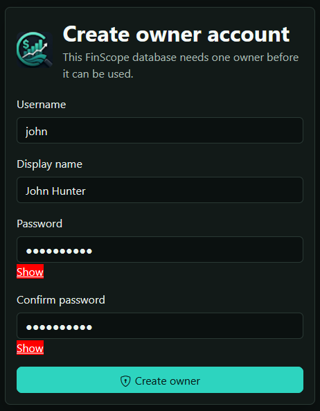
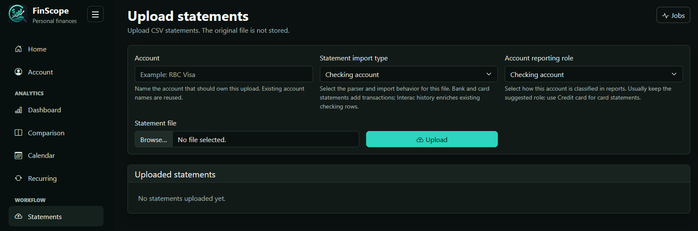
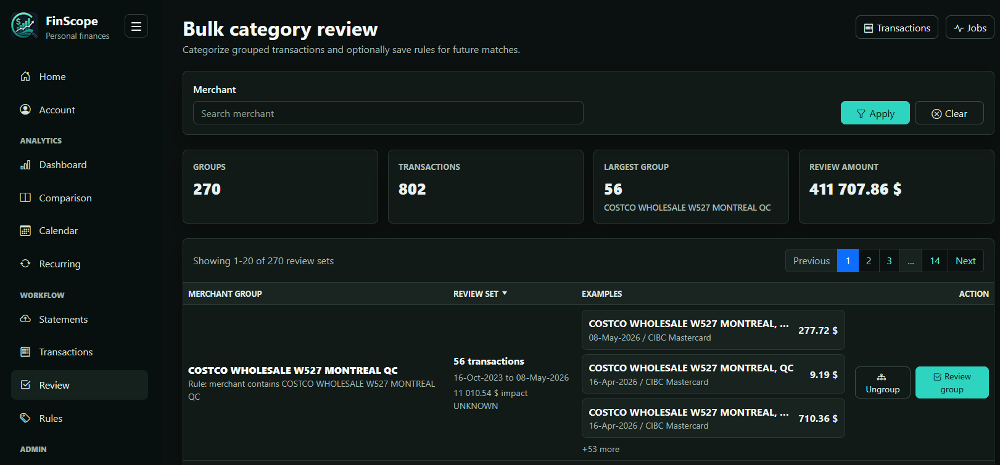
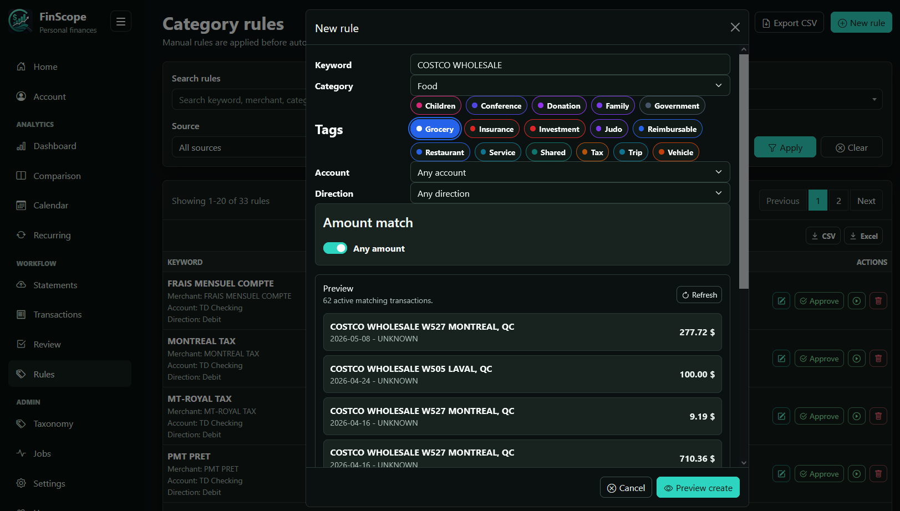
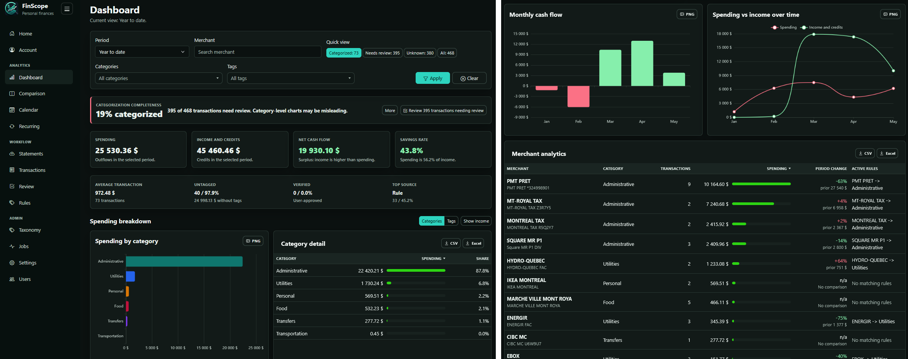
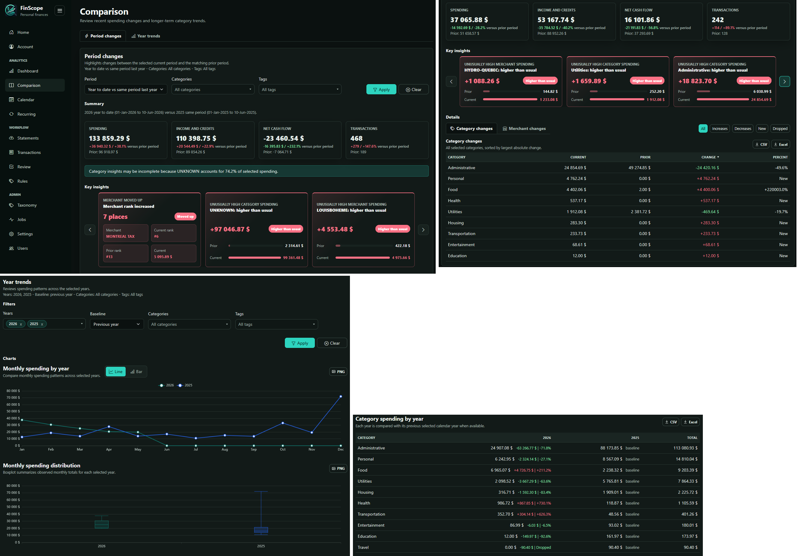

# Getting started

This walkthrough takes a new FinScope user from a fresh checkout to the first useful dashboard review. It keeps setup short and leaves deeper workflow advice to the [Tutorial](tutorial.md).

## Install and run FinScope

Start from the repository root.

<details open>
<summary>Windows PowerShell</summary>

```powershell
python -m venv .venv
.\.venv\Scripts\Activate.ps1
python -m pip install -r requirements.txt
Copy-Item src\finance_app\config.example.ini src\finance_app\config.ini
.\.venv\Scripts\python.exe -B src\finance_app\app.py
```

</details>

<details>
<summary>Windows cmd</summary>

```bat
python -m venv .venv
.venv\Scripts\activate.bat
python -m pip install -r requirements.txt
copy /Y src\finance_app\config.example.ini src\finance_app\config.ini
.venv\Scripts\python.exe -B src\finance_app\app.py
```

</details>

<details>
<summary>macOS</summary>

```bash
python3 -m venv .venv
source .venv/bin/activate
python -m pip install -r requirements.txt
cp src/finance_app/config.example.ini src/finance_app/config.ini
.venv/bin/python -B src/finance_app/app.py
```

</details>

<details>
<summary>Linux</summary>

```bash
python3 -m venv .venv
source .venv/bin/activate
python -m pip install -r requirements.txt
cp src/finance_app/config.example.ini src/finance_app/config.ini
.venv/bin/python -B src/finance_app/app.py
```

</details>

Modify `config.ini` according to your settings, including `database`, `server`, `categorization_model`, and `openai_api_key`.

If `config.ini` is left as default, open `http://127.0.0.1:5000` in a browser. FinScope uses the repository-level `runtime/finescope.db` SQLite database by default unless `FINANCE_DATABASE_URL`, `FINANCE_DB_PATH`, or `src/finance_app/config.ini` selects another database.

## Create the owner account

On an empty database, FinScope redirects application pages to `/auth/bootstrap`. Create the first owner username and password there. The owner can later create editor and viewer users from Users.



See [Authentication and authorization](authentication.md) for role permissions, password handling, and deployment notes.

## Import your first statement

Go to Upload and import one ordinary checking, savings, or credit card statement before trying enrichment-only files.

1. Enter the account name that should own the imported rows.
2. Choose the statement import type.
3. Keep the suggested account reporting role unless the account should behave differently in reports.
4. For a credit card, optionally enter the checking or savings account that pays the card.
5. Choose a CSV file.
6. Use Upload to open the preview modal.
7. If slash dates are ambiguous, choose `MM/DD/YYYY` or `DD/MM/YYYY`.
8. Confirm the import and watch progress on Jobs if a background job is queued.




Interac e-Transfer history is enrichment-only. Import the matching checking statement first, then import the Interac history for the same account so FinScope can enrich existing generic transfer rows instead of adding duplicate ledger rows.

## Review unknown transactions

After the first import, open Review. FinScope groups active transactions that need category review by merchant-like text.

1. Scan the summary cards and largest groups first.
2. Open Review group for a group that clearly belongs together.
3. Use Show all transactions when only some rows in the group should receive the same category.
4. Choose the category and optional tags.
5. Save a reusable rule only when the same pattern should apply in future imports.



## Create your first rule

Rules can be created directly from Rules or while reviewing/editing a transaction. A good first rule is a clear recurring merchant with a stable category.

1. Go to Rules.
2. Use New rule.
3. Enter a keyword, category, optional tags, optional account or direction scope, and optional amount bounds.
4. Review the preview.
5. Confirm creation only if the preview matches the intended transactions.




Rules created from the Rules page are keyword-fuzzy by default. Rules saved while editing a transaction can be merchant-bound when the transaction has a durable merchant identity.

## Open dashboard and comparison views

Open Dashboard after the first import to inspect categorization completeness, spending, income, net cash flow, savings rate, spending breakdowns, monthly cash flow, and merchant analytics.



Open Comparison after you have more than one useful period of data. Period changes compare the selected current period with a matching prior period. Year trends are more useful once multiple calendar years or enough months exist.



## Next reads

- Use the [Tutorial](tutorial.md) for first-month workflow, rule strategy, imports, review, AI categorization, and report interpretation.
- Use the [User guide](user-guide.md) as a concise feature reference.
- Use [Troubleshooting](troubleshooting.md) when imports, dates, duplicate uploads, ports, or AI categorization do not behave as expected.
