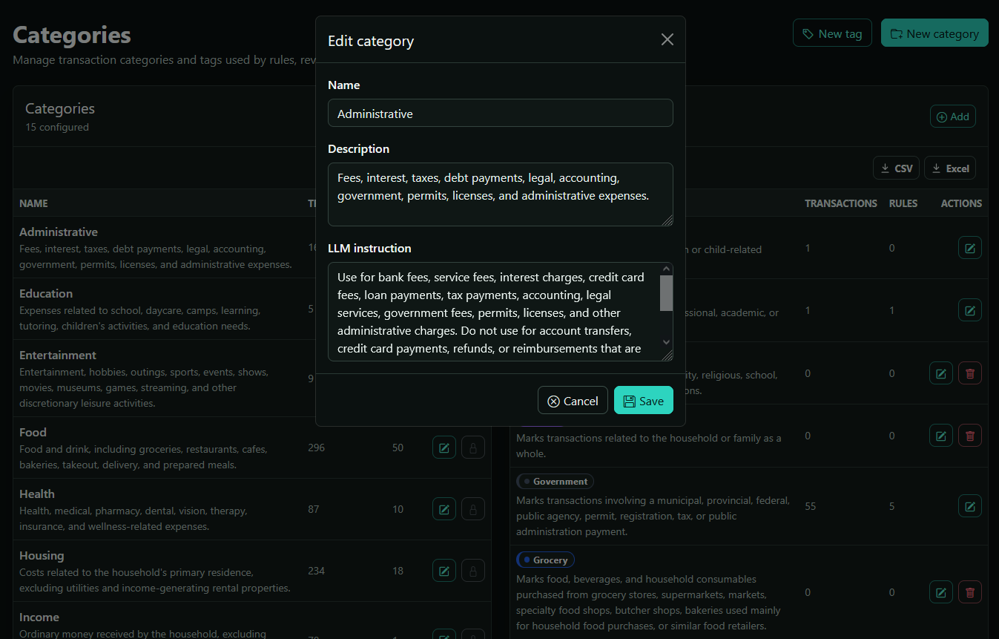

# Taxonomy and categorization

FinScope uses a database-backed taxonomy for categories and tags. The file `src/finance_app/categories.yml` provides the initial seed taxonomy during application setup, but it is not the runtime source of truth. Once the database has been initialized, categories and tags are managed through the application UI and stored in the database.

The taxonomy system is central to FinScope. Categories and tags drive dashboards and analytics, recurring activity detection, categorization rules, merchant review workflows, reporting and filtering, historical categorization, and optional LLM-assisted categorization.



## Categories and tags

Every transaction must belong to exactly one category and may optionally contain zero or more tags.

Categories represent the primary financial nature of a transaction. They answer questions such as:
- What kind of spending is this?
- What kind of income is this?
- What financial activity does this represent?

Typical categories include Groceries, Rent, Salary, Utilities, Transportation.

Categories are intentionally broad and stable because they are heavily used in charts, summaries, trends, and long-term analytics.

Tags provide additional optional context. Unlike categories, tags are non-exclusive and may overlap. Tags are useful for cross-cutting concerns and secondary classification.

For example:

```text
Category: Food
Tags: Work, Travel, Reimbursable
````

Tags are commonly used for, reimbursements, work-related expenses, vacations, medical claims, tax-related purchases, temporary projects or events.

A good category remains meaningful over years of historical data. A good tag adds contextual information without replacing the category.

## The taxonomy seed file

Before running FinScope for the first time, users may customize:

```text
src/finance_app/categories.yml
```

This file defines the initial categories and tags inserted into the database during initialization.

After the application has been initialized, taxonomy changes can only be performed through the FinScope UI rather than by editing the file directly. Directly modifying `categories.yml` after the database already contains categories and tags does not automatically synchronize existing runtime data.

## Taxonomy structure

Each category or tag contains: a unique name, a human-readable description, an optional instruction field used by LLM categorization.

Typical structure:

```yaml
- name: Groceries
  description: Food and household consumables purchased from grocery stores.
  instruction: Use for supermarkets, grocery chains, food markets, and recurring food shopping.
```

### Naming constraints

Category names and tag names must remain unique within their own groups.
Avoid names that differ only by capitalization, spacing, punctuation, or singular/plural form.
Prefer concise and descriptive names over abbreviations or personal shorthand.

Good examples: Transportation, Healthcare, Home Maintenance
Poor examples: Misc, Other2, Stuff, Random

### Writing effective categories

Categories should represent stable financial concepts rather than merchants or temporary situations.
Merchant-specific behavior should usually be handled through categorization rules rather than through dedicated categories.
Categories should answer *What kind of financial activity is this?* rather than *where was the purchase made?*

### Writing effective tags

Tags should provide secondary context that may apply across multiple categories.
Good tags are reusable, orthogonal to categories, optional, and descriptive.
Tags should answer questions such as *Was this reimbursable? Was this work-related? Was this part of a trip? Was this exceptional or temporary?*

Avoid creating tags that duplicate categories or that are too specific to a single transaction.

### Descriptions

The `description` field is intended primarily for human users.
It explains the meaning of a category or tag to reduce reduce ambiguity and guide users toward consistent categorization.
Descriptions should not contain prompt-engineering instructions, technical metadata, or excessive examples.

### Instructions

The `instruction` field is intended primarily for optional LLM-assisted categorization.
It helps the model distinguish similar categories, understand categorization boundaries, identify likely merchant patterns, and avoid incorrect classifications.

Instructions may contain merchant examples, inclusion guidance,exclusion guidance, semantic hints.

## Special built-in categories

### Unknown

The special `Unknown` category is reserved for transactions that could not be confidently categorized automatically.
Transactions assigned to `Unknown` should normally be reviewed manually. Users may assign a category directly to the transaction, or create a categorization rule.

> A high volume of unknown transactions reduces the usefulness and accuracy of analytics.

### Transfers

The special `Transfers` category is reserved for internal money movements that may appear multiple times across statements.
Typical examples include paying a credit card balance, moving money between checking and savings accounts, or internal account rebalancing.

> Transfer transactions are excluded from income and spending analytics to avoid double-counting money movement as real financial activity.

## Taxonomy administration

The taxonomy administration page allows authorized users to:
* create categories and tags,
* rename existing entries,
* update descriptions and instructions,
* delete unused entries.

Deletion is blocked when a category or tag is still referenced by transactions or rules.
Built-in categories cannot be modified or deleted.

## Categorization flow

FinScope categorizes transactions incrementally using deterministic rules, historical evidence, and optional LLM assistance.

The process follows this general order:

1. Normalize the merchant description.
2. Evaluate matching categorization rules.
3. Apply high-confidence deterministic matches.
4. Retrieve similar historical transactions.
5. Apply historical evidence when confidence is sufficient.
6. Keep unresolved transactions in `Unknown`.
7. Optionally invoke LLM categorization for unresolved transactions.
8. Preserve review requirements for uncertain results.

Rule-based categorization always runs before historical retrieval and LLM categorization.
Manual edits take precedence over automatic categorization.

Within one import batch, FinScope only reuses an automatic decision for transactions with the same durable merchant identity and the same signed amount. This prevents amount-specific rule or history evidence from leaking across different transaction amounts.

### Rule matching

FinScope supports two rule scopes merchant-bound and keyword-fuzzy rules.
**Merchant-bound rules** match transactions associated with a durable merchant identity.
**Keyword-fuzzy rules** use normalized substring matching against cleaned transaction descriptions and canonical merchant names.
For example, `VIREMENT` matches: `VIREMENT INTERAC 2`.

Rules may also be constrained by account, signed direction (`any`, `debit`, or `credit`), and optional amount bounds. Account and direction constraints make rules more specific and increase rule confidence when they match. Imported rule CSV files can include `account_name` and `direction`; an explicit account name must match an existing account so a misspelled scoped import does not become a broad rule.

Rule priority is deterministic. Higher-priority rules are evaluated first based on:

1. manual vs automatic/default,
2. amount-bounded vs unbounded,
3. merchant-bound vs keyword-fuzzy,
4. account-scoped and direction-scoped rules,
5. longer keywords vs shorter keywords.


### Historical categorization

Before using the LLM, FinScope retrieves similar previously categorized transactions from the local database.
Historical scoring considers merchant similarity, normalized descriptions, amount similarity, account matching, transaction direction, recency, and manually reviewed status.

High-confidence matches require strong agreement across similar transactions before they are applied automatically. Medium-confidence matches remain reviewable, and ambiguous or contradictory historical evidence is passed to the LLM as context instead of being finalized alone.

## LLM categorization

Automatic and manual category writes persist compact JSON evidence in `transactions.category_metadata`. The metadata uses a controlled audit `decision_source`: `rule`, `similar_transactions`, `llm`, `llm_with_similar_transactions`, `combined`, `manual`, or `unknown`.

LLM categorization is optional and requires `OPENAI_API_KEY`
The LLM receives unresolved transactions, rule evidence, historical evidence, a compact candidate taxonomy, and candidate tags/categories.
The prompt contract requires category IDs and tag IDs from the candidate taxonomy. Returned results are validated conservatively: invalid JSON, invalid category IDs, invalid tag IDs, invalid confidence values, low-confidence results, or inconsistent evidence remain categorized as `Unknown` or are marked for review according to the shared confidence policy.
