# Tutorial

This tutorial shows a practical way to start using FinScope with your own statement files.

Use it when you want a guided workflow. Use the [User guide](user-guide.md) when you need a quick feature reference.

## The basic FinScope loop

FinScope works best when you repeat this loop:

1. Import a statement.
2. Check the import preview before confirming.
3. Review unknown or uncertain transactions.
4. Save rules only for patterns you trust.
5. Read Dashboard, Calendar, Recurring, Reimbursements, and Comparison after the data is reasonably clean.

The first goal is not a perfect dashboard. The first goal is reliable transaction history.

## First 30 minutes

1. Create the owner account.
2. Import one checking or credit-card statement.
3. Confirm the date format in the preview.
4. Open Review and categorize the biggest unknown group.
5. Save one rule for a merchant you recognize.
6. Return to Dashboard and check whether the unknown count dropped.

## Optional: adjust categories and tags before first use

FinScope comes with starting categories and tags. Most users can keep them and adjust categories later from Admin > Categories and tags.

Advanced users who already know their preferred ordinary category and tag list can edit `src/finance_app/taxonomy.yml` before creating the first database. This seed file is used only during initial database setup and does not define FinScope's built-in system categories or tags. After FinScope has created the database, use Admin > Categories and tags for changes.

Good categories and tags habits:

- Keep categories broad and stable enough to work across years of history.
- Use tags for extra context such as work, travel, reimbursable, shared expense, medical, tax, or a temporary project.
- Avoid merchant names as categories unless the merchant is truly the financial purpose.
- Avoid tags that merely duplicate categories.
- Write descriptions for humans and AI guidance for optional AI categorization.

## First month workflow

The first month is about building reliable history, not perfect dashboards.

1. Create the owner account.
2. Import checking and savings statements first.
3. Import credit card statements after deciding their account reporting role and paid-from account.
4. Import Interac e-Transfer history only after the matching checking rows exist.
5. Check Upload > Uploaded statements for added, skipped, ignored, unknown, and failed counts.
6. Open Review and categorize the biggest unknown groups.
7. Remember stable merchant patterns for future matches.
8. Use Rules > Preview apply all rules after creating or importing several rules.
9. Open Reimbursements, Dashboard, Calendar, Recurring, and Comparison to find obvious cleanup needs.

Repeat that loop for the next statement. The app becomes more useful as rules and reviewed history accumulate.

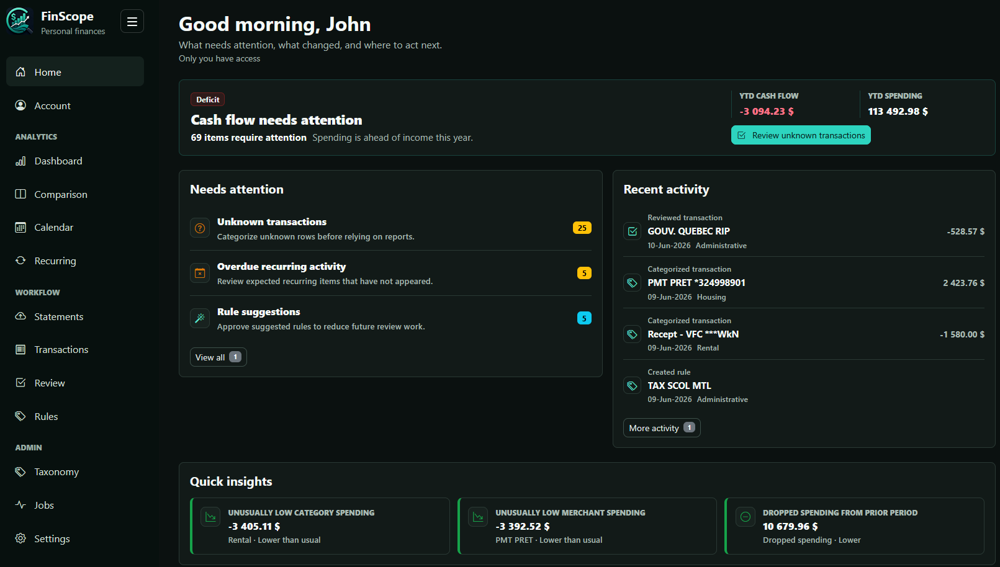

## Upload statements

Use the statement import type that matches the file:

| Statement type | Typical role | How to think about it |
| --- | --- | --- |
| Checking account | Checking or savings | Creates transactions for bank activity. |
| Credit card | Credit card | Creates purchase-level transactions. Card payments are marked as payments/transfers so spending is not double-counted. |
| Interac e-Transfer | Checking account | Updates existing checking transactions with clearer merchant details. It does not add duplicate transactions. |

The upload preview is important. It shows parsed dates, descriptions, amounts, imported row counts, ignored row counts, and date-format handling. For ambiguous slash dates, choose the correct `MM/DD/YYYY` or `DD/MM/YYYY` option before confirming.

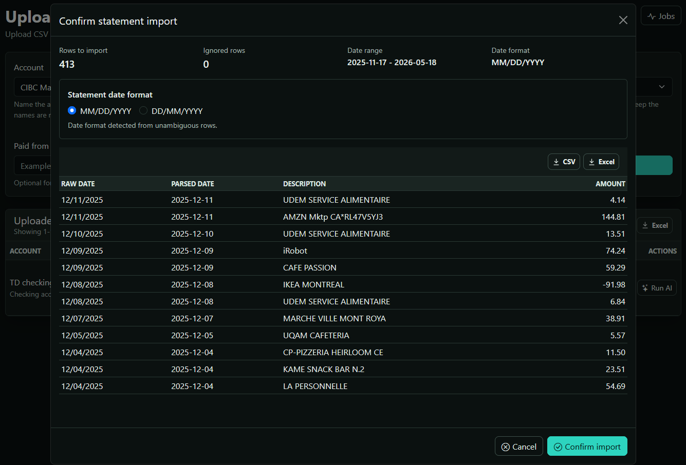

### Why rows may be skipped or ignored

Skipped usually means FinScope chose not to insert a row that should not become a new transaction, such as a duplicate transaction fingerprint or an ambiguous Interac match.

Ignored usually means the parser recognized a row but decided it is not importable as a transaction, such as a non-transaction row. For Interac history, ignored rows can also be cancelled, non-deposited, or missing a matching checking transaction.

Exact duplicate files are blocked by statement checksum. If the previous upload created a statement record but the import failed, use Retry from Uploaded statements. Use Reprocess when you want to remove transactions imported from that statement and import them again from the stored statement text.

Common import errors and fixes:

- Wrong statement type: reprocess with a corrected statement type if the parser or sign behavior was wrong.
- Ambiguous dates: use preview date-format controls before importing.
- Unrecognized CSV shape: check that the file has recognizable date, description, and amount/debit/credit columns, or a compact `date,description,amount` shape.
- Interac imported too early: import the matching checking statement first, then reprocess the Interac history.
- Credit card payments counted as spending: confirm the account reporting role and paid-from account, then reprocess the card statement if needed.

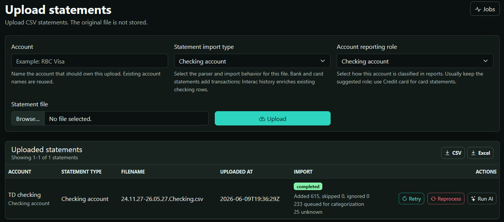

## Manage transactions

Transactions is the detailed transaction view. Use it when you need to search, filter, approve, ignore, or directly edit rows.

Useful transaction actions:

- Approve a row when its current category and tags are correct.
- Ignore a row when it should stay in transaction history but not affect normal review work.
- Edit category and tags when a row is wrong or incomplete.
- Use Remember for future matches while editing when future matching rows should be categorized the same way.
- Use batch actions to approve selected rows, ignore selected rows, or recategorize selected rows.

## Build rules deliberately

Rules are the strongest day-to-day automation tool. Create fewer, clearer rules before creating many broad ones.

Merchant-specific rules are best when the transaction has a durable merchant identity and the merchant always means the same thing. They are commonly created from a transaction edit or review flow.

Approximate keyword rules are best when a normalized keyword reliably appears in transaction descriptions or merchant names. Rules created directly from the Rules page use an approximate keyword by default.

Use optional scopes to make rules safer:

- Account scope when the same keyword means different things on different accounts.
- Direction scope when debit and credit rows should be categorized differently.
- Amount bounds when a merchant has multiple predictable payment types.
- Tags when the same rule should attach secondary context.

Creating or editing a rule saves the future matching behavior first and leaves historical transactions untouched. Use the rule preview in the editor when you want to inspect active matches before saving. Deleting applied rules, importing rules, applying one rule to existing transactions, and applying all rules should show impact before the historical mutation.

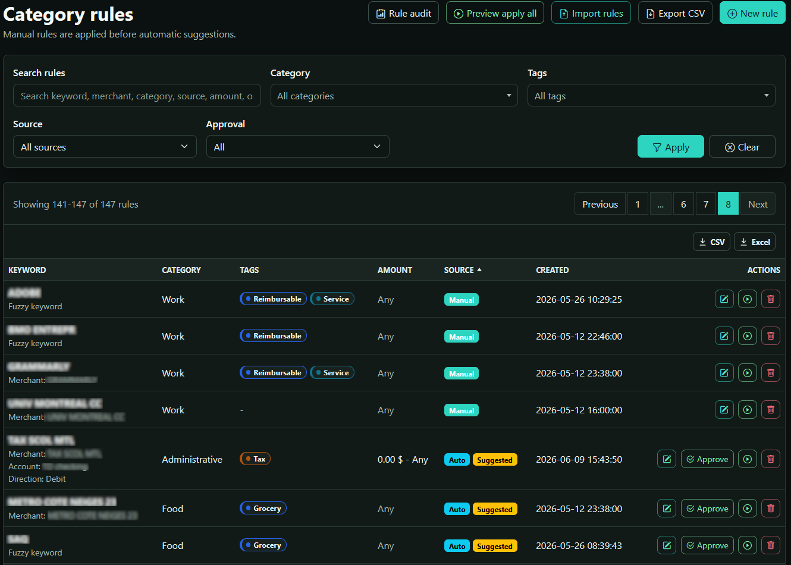

### Importing and applying rules

Rules can be exported and imported as CSV. Imported rows use the export format shown in the import modal, including keyword, account name, merchant name, category, tags, amount bounds, direction, source, and created timestamp.

Use Add new rules only when merging rules from another database or backup. Use Override all rules only when you intentionally want to replace the current rule set; the resulting processing item can be undone from Processing when undo metadata is still available.

To apply one rule, use its preview apply action and confirm the preview. To apply many rules, use Preview apply all rules. FinScope applies rule precedence rather than blindly rewriting every matching transaction. Where the audit exposes a force-apply action, treat it as an explicit override and review the preview carefully.

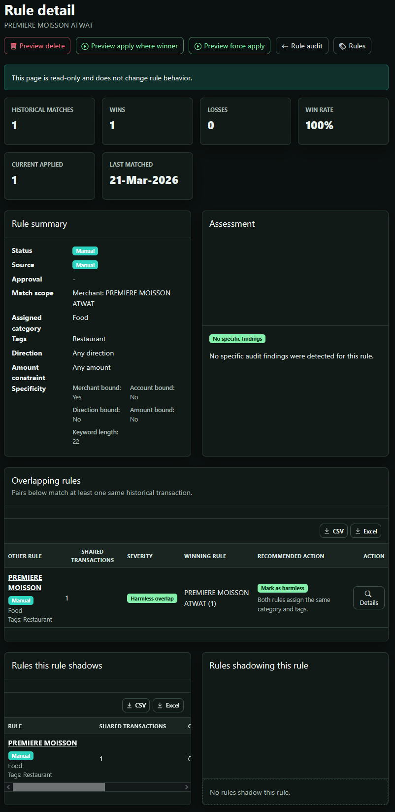

### Rule matching order

When more than one rule matches, FinScope uses deterministic precedence. Higher-priority rules are evaluated first based on:

1. Manual versus automatic/default source.
2. Amount-bounded versus unbounded rules.
3. Merchant-bound versus approximate keyword scope.
4. Account-scoped and direction-scoped rules.
5. Longer keywords versus shorter keywords.

Manual edits take precedence over automatic categorization. Rule-based categorization runs before historical retrieval and optional AI categorization.

## Use optional AI categorization carefully

AI categorization is optional and requires `OPENAI_API_KEY` or the equivalent config setting. By default, imports keep remaining unknown rows available for manual AI runs from Uploaded statements or Processing after FinScope shows an AI usage estimate. Owners can turn that confirmation step off in Settings > Categorization; when it is off, imports automatically queue AI categorization for remaining unknown rows.

AI fits after deterministic categorization:

1. Rules run first.
2. Historical evidence is considered.
3. Remaining unknown rows can be sent to AI automatically when AI usage review is off, or manually requested when review is on.
4. Low-confidence or review-required results stay reviewable.

FinScope privacy-minimizes external AI prompts. It does not send raw transaction descriptions, exact dates, exact amounts, account names, account types, account IDs, or similar-transaction examples.

Use Processing > Run AI on unknowns for a broad pass. Use Upload > Uploaded statements > Run AI for one statement. If enabled in Settings, use Suggest category from a transaction row for a one-row preview before choosing Apply once or Remember for future matches.

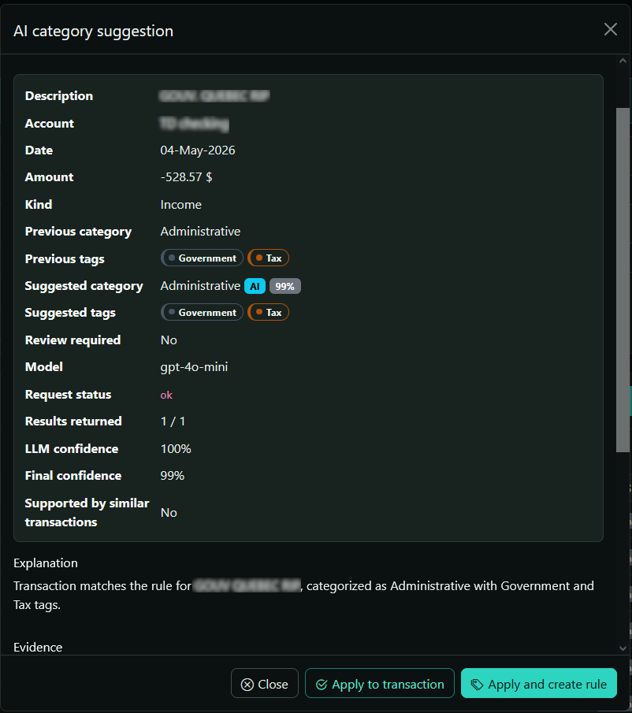

## Review unknowns

The Review module is optimized for resolving unknown or review-required transactions in groups.

Recommended review flow:

1. Sort or search to find high-impact merchant groups.
2. Open Review group.
3. Check the examples and total impact.
4. Use Show all transactions when the group may contain exceptions.
5. Select only the rows that should receive the same category when needed.
6. Choose a category and optional tags.
7. Use Remember for future matches only when future rows should match the same way.
8. Check Processing for background review operations.

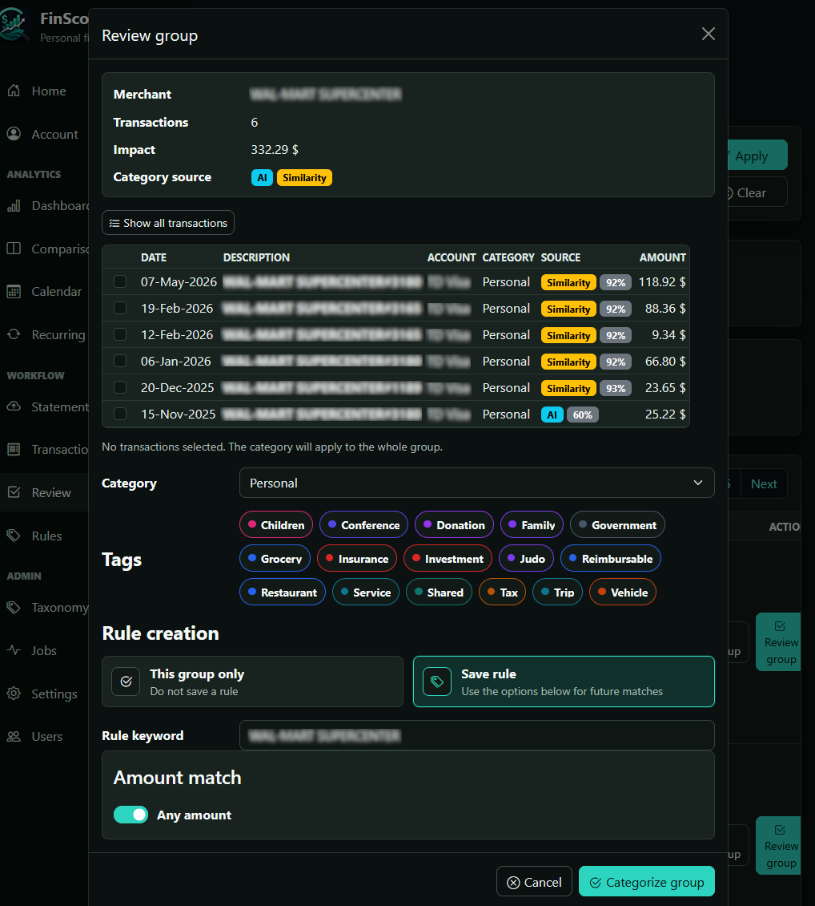

## Read the main pages

### Home

Home is the operating view. It summarizes what needs attention, recent activity, quick insights, and shortcuts to the next likely action. Treat it as a triage page after imports or long-running processing activity.

### Dashboard

Dashboard is the current analysis view. It includes categorization completeness, spending, income and credits, net cash flow, savings rate, average transaction, untagged rate, verified rate, spending breakdowns, monthly cash flow, spending versus income over time, and merchant analytics.

Unknown categories reduce report usefulness. Use the categorization completeness panel and Review link when Dashboard warns about data quality.

Transfers are visible in Transactions but are excluded from spending and income totals to avoid double-counting internal money movement. Credit card payment rows and matching funding-account payment rows are treated as payments/transfers. Reimbursement credits use the built-in `Reimbursement` category and explicit allocations; allocated amounts reduce the original expense category instead of appearing as ordinary income.

Use account and merchant filters when you want an analysis slice you can return to later, such as one credit card and one merchant across several months. Analytics pages keep those filters in the URL so refresh, back/forward navigation, and copied links preserve the view.

### Comparison

Comparison has two major views:

- Period changes compare the selected current period with the matching prior period and highlight category and merchant changes.
- Year trends compare monthly spending, income and credits, or net cash flow patterns across selected years and summarize category totals by year.

Large `UNKNOWN` category shares can make category comparisons unreliable, so review unknowns before drawing conclusions. Period comparisons are most useful when both periods have similar import completeness.

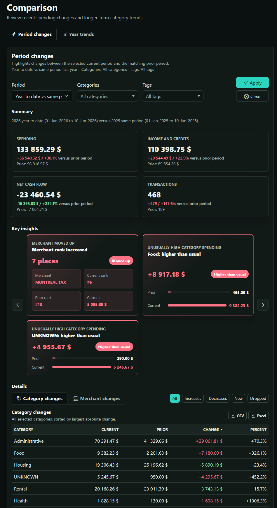
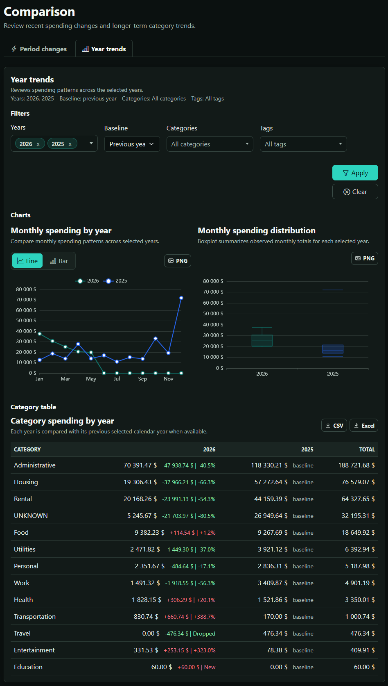

### Calendar

Calendar shows posted daily transactions for a selected month. It summarizes spending, income and credits, net cash flow, and expected recurring activity. The account and merchant filters narrow visible days, monthly totals, transaction drill-downs, and recurring evidence. The heatmap can show spending, income, or net cash flow. Double-click a day or use the day link to inspect that day's transactions.

### Recurring

Recurring detects repeated spending and income patterns. Use it to confirm useful patterns, ignore noise, inspect overdue items, and track amount changes. It has list and calendar views, account and merchant filters, status filters, category/tag filters, confidence level filtering, month navigation, and detail modals with confirm, ignore, and edit actions for users with recurring-edit permission.

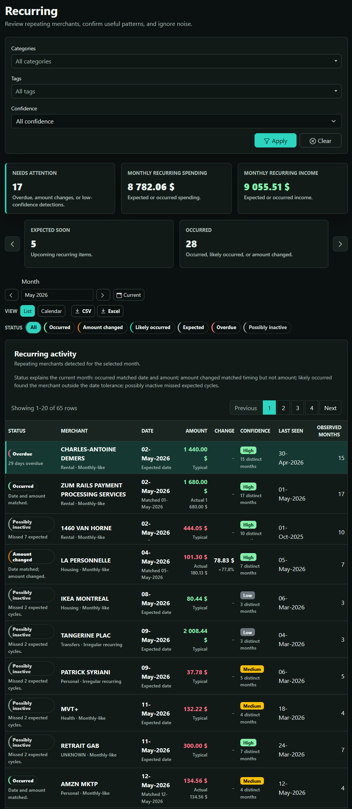

## Settings controls

Every authenticated user can update General settings such as theme mode, interface language, and personal table/display limits.

Owners can also manage advanced settings:

- Categorization settings: AI usage review, single-transaction AI action visibility, confidence thresholds, and AI model setup checks.
- Recurrence detection settings: minimum occurrences, date tolerance, amount tolerance, and missed-cycle defaults.
- Statement settings: statement import type names, parser mappings, import behavior, and default account role.

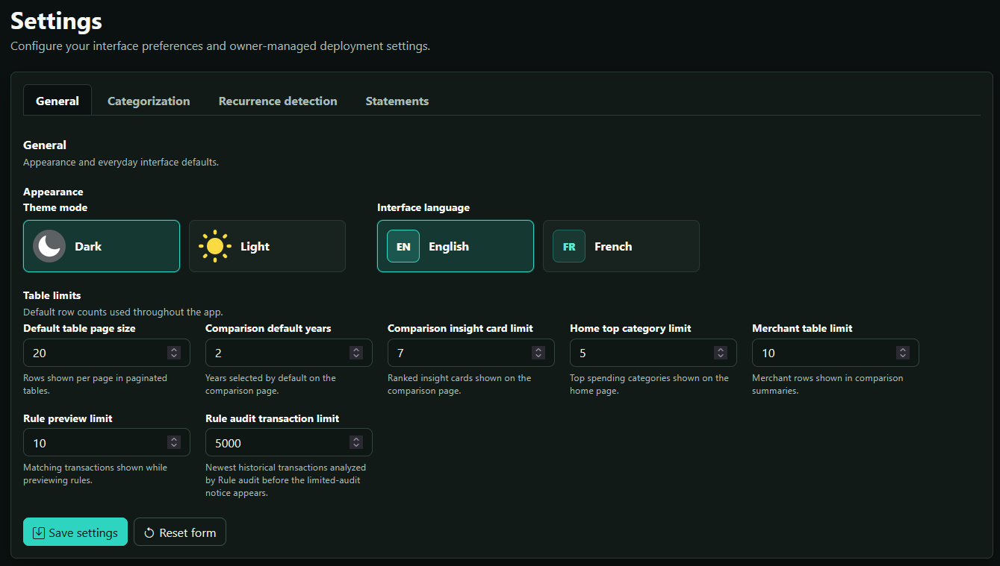

## Plain-language glossary

- Category: the main type of a transaction, such as Food, Housing, Travel, or Income.
- Tag: an optional label for extra context, such as Work, Tax, Trip, or Reimbursable.
- Rule: a saved instruction that categorizes future matching transactions.
- Unknown: a transaction FinScope could not categorize confidently.
- Review: the step where you confirm or correct categories.
- Reimbursement match: a link between money you received back and the expense it repays.
- Processing: longer work that continues in the background, such as imports, AI categorization, rule applications, and undoable actions.

## Common mistakes and recommended practices

Common mistakes:

- Importing Interac history before checking-account statements.
- Using a credit card statement type with a non-credit account role.
- Treating transfers as spending.
- Creating categories for every merchant.
- Creating broad approximate keyword rules without previewing matches.
- Editing `taxonomy.yml` after the database is already initialized and expecting live data to change.
- Drawing conclusions from Dashboard or Comparison while many transactions are still Unknown.
- Turning off AI usage review before a large cleanup you have not reviewed.

Recommended practices:

- Start with ordinary checking and credit card statements before enrichment sources.
- Review Upload counts after every import.
- Resolve large unknown groups before fine-tuning small rows.
- Prefer merchant-bound or scoped rules for ambiguous merchants.
- Use tags for reimbursable, work, travel, tax, and shared-expense overlays.
- Export rules and categories/tags before large restructuring work.
- Keep AI usage review on when you want to run AI manually after deterministic rules and obvious review work have done their part.
- Back up the active database regularly.
